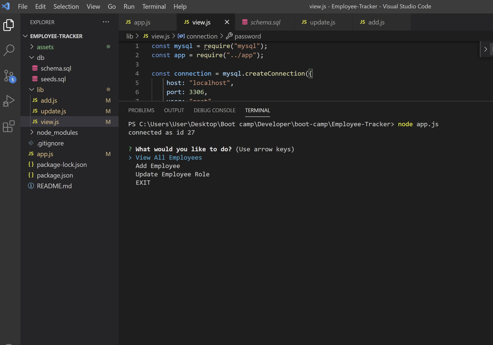
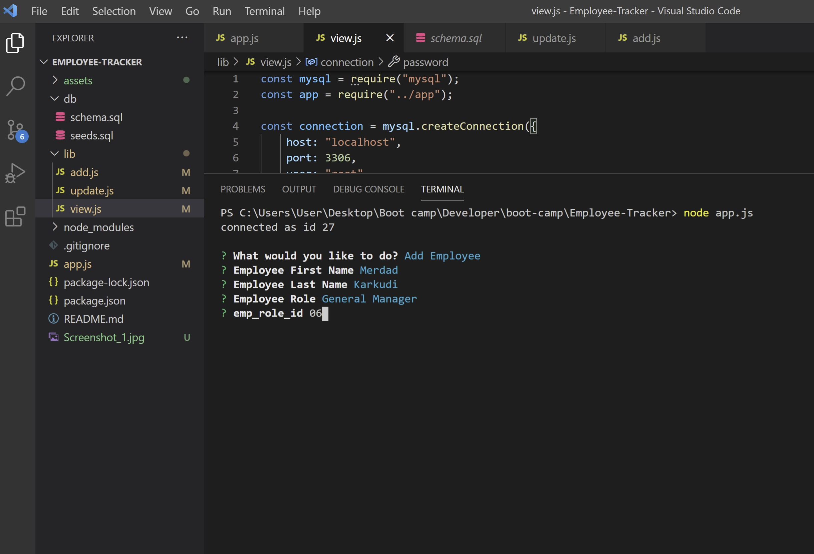
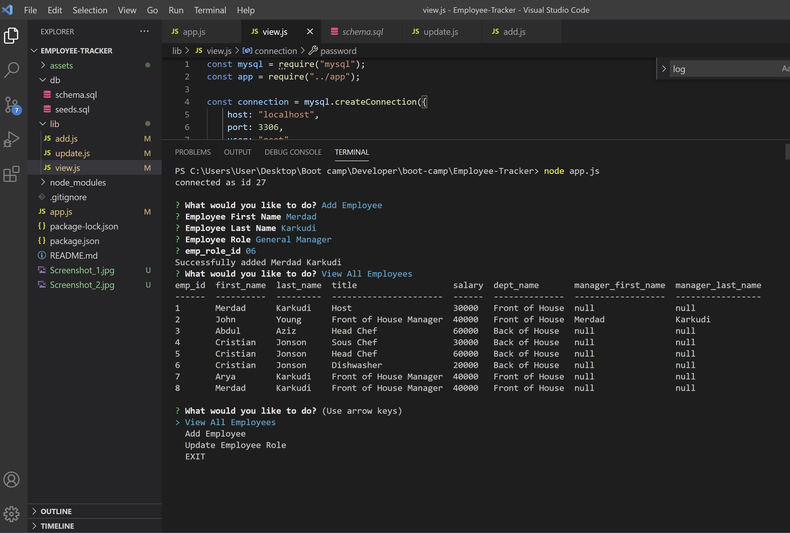

# Employee-Tracker# Employee_Tracker
# by Merdad Karkudi

App for business to be able to view and manage the departments, roles, and employees in their company so that they can organize and plan their business better.

# Technologies Used
1. Node.js
2. MySQL
3. NPM
4. ES6

# Table of Contents

- [Installation](#installation)
- [Instructions](#instructions)
- [Features](#features)
- [Example Gif](#example-gif)
- [Repository Link](#Repository)
- [Test](#Test)
- [Licence](#Licence)
- [GitHub Info](#GitHub)

## Installation

- Use the [MySQL](https://www.npmjs.com/package/mysql) NPM package to connect to your MySQL database and perform queries.

  > npm install

- Use [InquirerJs](https://www.npmjs.com/package/inquirer/v/0.2.3) NPM package to interact with the user via the command-line.

  > npm install mysql inquirer

- Use [console.table](https://www.npmjs.com/package/console.table) to print MySQL rows to the console. There is a built-in version of `console.table`, but the NPM package formats the data a little better for our purposes.
  > npm install console.table --save

## Instructions

> Use console command [node index.js] to run application in terminal.

## Features

- View Employees
- View Roles
- Add Employee
- Add Role
- Update Employee Role
- Update Employee Manager
- Remove Employee
- Remove Role

## Example Pictures

## demo Video
https://github.com/mkarkuody/Employee-Tracker/blob/main/assets/Employee%20Tracker.mp4

## Test

## Licence

